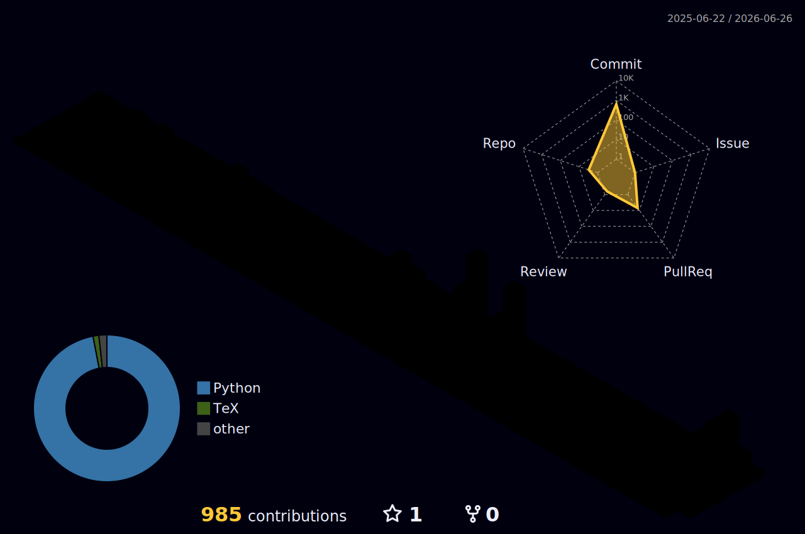

### 🛰️ Venturing into the Infinite Unknown · Based in Verona, Italy

---

## 👨‍💻 About Me

I'm a **Computer Science & Engineering graduate** (M.Sc., University of Verona — **105/110**) with a strong passion for building robust, scalable backend systems and clean full-stack applications. I thrive when diving deep into system architecture, API design, and performance-oriented code.

Lately I've been exploring the **AI/ML engineering** space — bridging traditional software engineering with modern AI tooling and intelligent systems. I'm always open to new opportunities where I can bring both depth and curiosity to a team.

- 🎓 **M.Sc. Computer Science & Engineering** — University of Verona · 105/110
- 🔭 Currently exploring **AI engineering, LLM integration & ML pipelines**
- 💼 **Open to work** — Backend, Full-Stack, or AI-adjacent engineering roles
- 🌍 Based in **Verona, Italy** · Available remotely or on-site
- 📫 Reach me at **[ledjolleshaj@yahoo.com](mailto:ledjolleshaj@yahoo.com)**

---

## 🛠️ Tech Stack

**Languages**

<!-- 
 -->

**Backend & Frameworks**

**Frontend**

**DevOps & Tools**

**Currently Learning**

---

## 🚀 Featured Projects

| Project                                                                                   | Description                                                                                                                                                                            | Stack                                           |
| ----------------------------------------------------------------------------------------- | -------------------------------------------------------------------------------------------------------------------------------------------------------------------------------------- | ----------------------------------------------- |
| [**Full-Stack ERP — Selita Fish**](https://github.com/LedjoLleshaj/Full-stack-ERP)        | End-to-end ERP system for a fish store business. REST API backend, relational data model, and a responsive SPA frontend — all fully containerised and orchestrated with Docker Compose | Python · Django · Angular · PostgreSQL · Docker |
| [**Vue Job Search**](https://github.com/LedjoLleshaj/Vue-job-search)                      | Front-end for a workers & seasonal job finding platform with search and filtering                                                                                                      | TypeScript · Vue.js                             |
| [**System Calls — OS**](https://github.com/LedjoLleshaj/System-calls-C-Operating-systems) | Client–Server application built exclusively with Linux system calls in C, no standard libraries                                                                                        | C · Linux · POSIX                               |

> 🔎 Explore all **22 repositories** → [github.com/LedjoLleshaj](https://github.com/LedjoLleshaj?tab=repositories)

---

## 📊 GitHub Stats

&nbsp;

---

## 🌐 3D Contribution Graph

---

_"Programming is like being able to do magic."_

