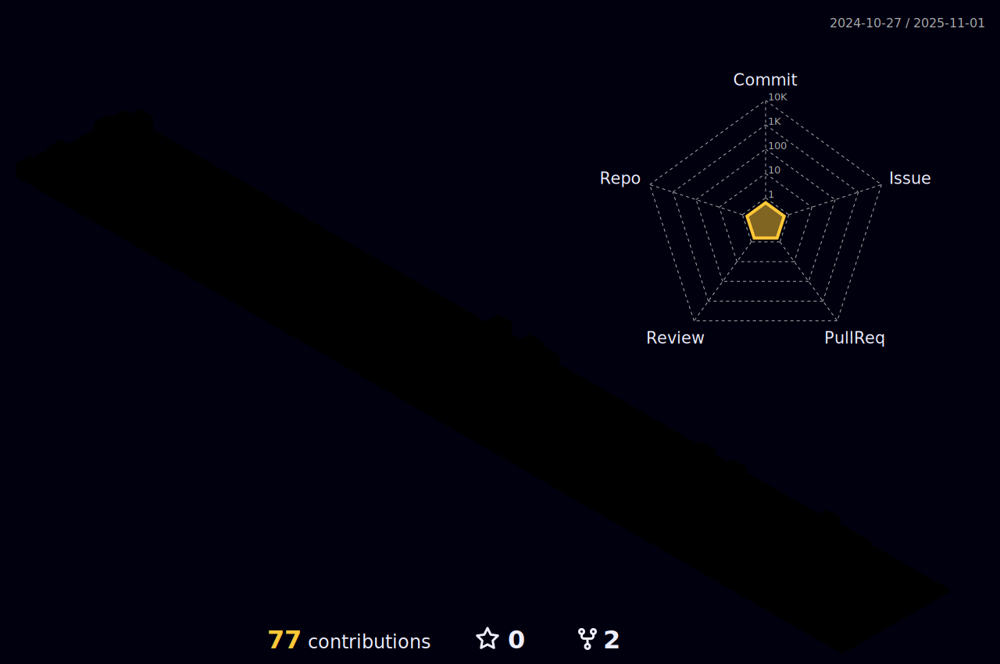

<h1 align="center">Hi 👋, I'm Ledjo</h1>
<h3 align="center">A passionate CompSci student at University of Verona</h3>

  

- 🌱 I’m currently learning **VueJs and PostgreSQL**

- 💬 Ask me about **anything**

- 📫 How to reach me **ledjolleshaj@yahoo.com**

<h3 align="left">Connect with me:</h3>

<h3 align="left">Languages and Tools:</h3>

                

  
<b>:gear: &nbsp;Git statistics</b>

  
  
 
 
 

